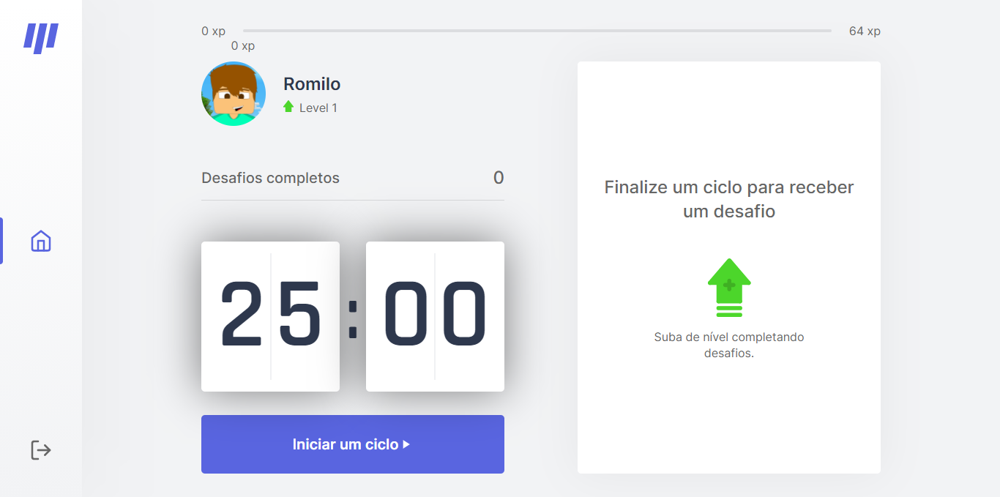

<h1 align="center">
  
</h1>

  <a href="#-tecnologias">Tecnologias</a>
  •
  <a href="#-projeto">Projeto</a>
  •
  <a href="#-layout">Layout</a>
  •
  <a href="#-como-executar">Como executar</a>
  •
  <a href="#-licença">Licença</a>

  

  

  

  

## 🛠 Tecnologias
* [React](https://reactjs.org/)
* [Next.js](https://nextjs.org/)
* [Typescript](https://www.typescriptlang.org/)

## 💻 Projeto
O move.it é uma aplicação que une a técnica de Pomodoro com a realização de exercícios físicos para quem passa muito tempo no computador.

O desenvolvimento deste projeto foi iniciado na Trilha React da **[Next Level Week #04](https://nextlevelweek.com)** da **[@Rocketseat](https://github.com/Rocketseat)** 🚀

## 🔖 Layout
O layout deste projeto foi criado pelo **[Tiago Luchtenberg](https://www.instagram.com/tiagoluchtenberg/)** e está disponível no figma [neste link](https://www.figma.com/file/ge20pu3ofMOKoliUyKx1Nl/Move.it-1.0)

## 🚀 Como executar
* Clone o repositório com `git clone https://github.com/rodev9/moveit.git [NOME_DO_PROJETO]`
* Entre na pasta do projeto com `cd [NOME_DO_PROJETO]`
* Instale as dependências com `yarn` ou `npm i`
* Inicie o servidor com `yarn dev` ou `npm run dev`

Agora você pode acessar [`localhost:3000`](http://localhost:3000) do seu navegador.

## 📝 Licença
Este projeto está sob a licença MIT. Veja o ficheiro [LICENSE](LICENSE.md) para mais detalhes.

---

Desenvolvido com 🧡 por Rodrigo

